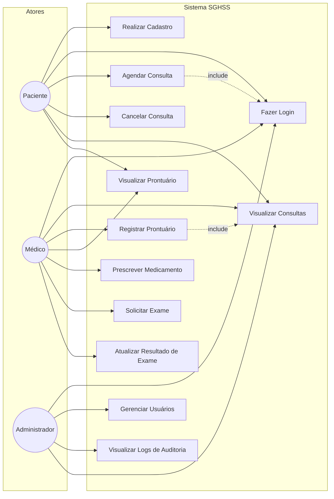

# Diagrama de Casos de Uso - SGHSS

## Descrição dos Casos de Uso

| Caso de Uso | Descrição |
| --- | --- |
| UC1 | Realizar Cadastro | Paciente | Criar conta no sistema com dados pessoais |
| UC2 | Fazer Login | Todos | Autenticar-se para acessar funcionalidades protegidas |
| UC3 | Agendar Consulta | Paciente | Marcar uma consulta com médico |
| UC4 | Cancelar Consulta | Paciente | Cancelar uma consulta previamente agendada |
| UC5 | Visualizar Consultas | Paciente, Médico, Administrador | Listar consultas agendadas com filtros |
| UC6 | Registrar Prontuário | Médico | Criar registro clínico do paciente após a consulta |
| UC7 | Visualizar Prontuário | Paciente, Médico | Consultar histórico clínico do paciente |
| UC8 | Prescrever Medicamento | Médico | Registrar prescrição vinculada ao prontuario |
| UC9 | Solicitar Exame | Médico | Solicitar exame clínico para o paciente |
| UC10 | Atualizar Resultado de Exame | Médico | Registrar resultado de exame realizado |
| UC11 | Gerenciar Usuários | Administrador | Cadastrar, editar e excluir usuários do sistema |
| UC12 | Visualizar Logs de Auditoria | Administrador | Consultar registros de auditoria do sistema |