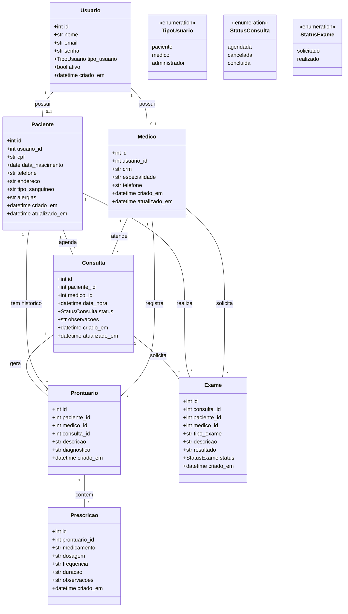

# Diagrama de Classes - SGHSS

## Relacionamentos

| Origem | Destino | Tipo | Descrição |
|---|---|---|---|
| Usuario | Paciente | 1:0..1 | Um usuário pode ter um perfil de paciente |
| Usuario | Medico | 1:0..1 | Um usuário pode ter um perfil de médico |
| Paciente | Consulta | 1:N | Um paciente pode ter várias consultas |
| Medico | Consulta | 1:N | Um médico pode atender várias consultas |
| Consulta | Prontuario | 1:0..1 | Uma consulta pode gerar um prontuário |
| Prontuario | Prescricao | 1:N | Um prontuário pode ter várias prescrições |
| Consulta | Exame | 1:N | Uma consulta pode solicitar vários exames |