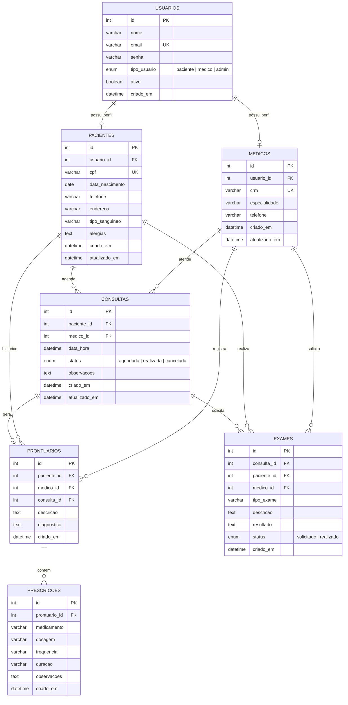

# MER - Modelo Entidade-Relacionamento - SGHSS

## Tabelas e Campos

| Tabela | Campos Chave | Descrição |
|---|---|---|
| usuarios | id (PK), email (UK) | Dados de autenticação de todos os usuários |
| pacientes | id (PK), usuario_id (FK), cpf (UK) | Dados clínicos e pessoais do paciente |
| medicos | id (PK), usuario_id (FK), crm (UK) | Dados profissionais do médico |
| consultas | id (PK), paciente_id (FK), medico_id (FK) | Agendamentos de consultas |
| prontuarios | id (PK), paciente_id (FK), medico_id (FK), consulta_id (FK) | Registros clínicos |
| prescricoes | id (PK), prontuario_id (FK) | Prescrições de medicamentos |
| exames | id (PK), consulta_id (FK), paciente_id (FK), medico_id (FK) | Exames solicitados e resultados |
